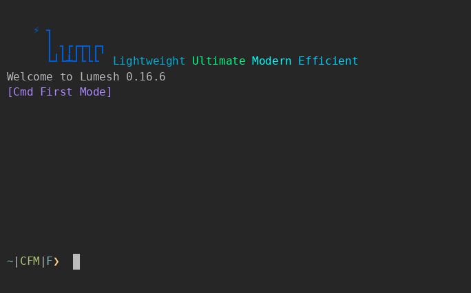

[English](README.md) | 简体中文

# Lumesh —— 你的下一个默认 Shell

[]()
[]()
[]()

[Codeberg](https://codeberg.org/santo/lumesh)
| [GitHub](https://github.com/superiums/lumesh)
| [文档](https://www.lumesh.cc.cd/zh-cn)
| [DeepWiki](https://deepwiki.com/superiums/lumesh)
| [发布页 1](https://github.com/superiums/lumesh/releases)
| [发布页 2](https://codeberg.org/santo/lumesh/releases)
| [语法高亮插件](https://github.com/superiums/tree-sitter-lumesh)
| [最新动态](NEWS-cn.md)

```
     ⚡┓
      ┃ ┓┏┏┳┓┏┓
      ┗┛┗┻┛┗┗┗  Lightweight · Ultimate · Modern · Efficient
```

> **像写 JS 一样编写脚本，像 Bash 一样调用命令，像光一样运行。**


---

## 你还在忍受 Bash 的这些痛苦吗？

```bash
# Bash：字符串比较要加引号，否则报错
if [ "$var" = "hello" ]; then ...

# Bash：数组？关联数组？语法像在解谜
declare -A map
map["key"]="value"
for k in "${!map[@]}"; do echo "$k: ${map[$k]}"; done

# Bash：错误处理几乎靠 set -e，一旦出错整个脚本崩溃
set -e
some_command || echo "failed"

# Bash：想处理一个 JSON 列表？先装 jq，再写一堆管道，再祈祷不出错  [header-1](#header-1)
result=$(cat data.json | jq -r '.[] | select(.age > 18) | .name' 2>/dev/null) || echo "failed"  
  
```
**Bash 诞生于 1989 年。它从未为现代开发者设计。**

你每天都在和它的历史包袱搏斗：
- 字符串和数组的语法陷阱让人抓狂
- 错误处理要么全退出，要么全忽略，没有中间地带
- 结构化数据处理完全依赖外部工具
- 脚本一长就变成无法维护的"shell 意大利面"

**是时候换一个为现代人设计的 shell 了。**

## 认识 Lumesh —— 你的下一个 Shell


Lumesh 是用 Rust 编写的现代 shell 和脚本语言，完全兼容外部命令，同时带来类似js的编程能力。

不需要抛弃你已有的知识。 ls、git、grep、curl——所有命令照常运行。你只是获得了更好的一切。

---
## 对比一下，感受差距

### 错误处理：从噩梦到优雅

```bash
# Bash 的方式：脆弱、啰嗦
if ! command_that_might_fail 2>/dev/null; then
    echo "failed" >&2
    exit 1
fi
```

```bash
# Lumesh 的方式：7 种精准的错误操作符
command ?.          # 忽略错误，继续执行
command ?: handler  # 出错时使用默认值/处理函数
command ?!          # 出错时终止整个管道
command ?~          # 将错误转为布尔值 false
```

### 数据处理：告别 awk/sed/jq 的组合拳

```bash
# 过滤大文件，只保留 5K 以上的条目，只显示名称和大小
fs.ls -lh | where(size > 5K) | select(name, size, modified)

# 对列表做 map/filter，就像写 JavaScript
1...100 | list.filter(x -> x % 2 == 0) | list.map(x -> x * 2)

# 批量操作：把当前目录所有文件复制到 /tmp/
ls -1 |> cp -r _ /tmp/
```

### 变量和数据结构：终于像个正常语言了

```bash
# 解构赋值
let user = {name: "Lume", age: 3}
let {name, age} = user

# 范围和链式调用
"hello world".split(' ').join('-')   # => "hello-world"

# 类型丰富：List、Map、Set、Range，全部原生支持
let scores = [95, 87, 72, 88]
let avg = scores | list.foldl((a, b) -> a + b) | _ / scores.len()
```

### 模块化脚本：写大项目不再是灾难

```bash
use my_utils as utils
utils::send_report(data)

@retry(3)           # 装饰器：失败自动重试 3 次
@log_time           # 装饰器：自动记录执行时间
fn deploy() { ... }
```

---

## 性能：不只是更好用，还更快

| 对比项目           | lume  | bash | dash  | fish  |
| ------------------ | ----- | ---- | ----- | ----- |
| 速度（百万次循环） | ★★★★★ | ★★★  | ★★★★  | 无法完成  |
| 语法友好度         | ★★★★★ | ★★   | ★     | ★★★★  |
| 错误提示质量       | ★★★★★ | ★    | ★     | ★★★   |
| 错误处理能力       | ★★★★★ | ★    | ★     | ★     |
| 内置函数库         | ★★★★★ | —    | —     | ★     |
| 交互体验           | ★★★★★ | ★★   | ★     | ★★★★★ |
| 二进制体积         | ★★★★  | ★★★  | ★★★★★ | ★★    |
| 结构化管道         |  √    | —    | —     | —     |
| AI 辅助            | ✅√   | —    | —     | —     |

|  |  |
| --------------------------------- | ---------------------------------- |

> 从 v0.10.1 起，循环性能提升约 2 倍；从 v0.11.0 起，内存占用下降约 0.8 MB。

---

## Bash vs Lumesh 语法速查

| 场景           | Bash                                  | Lumesh                         |
| -------------- | ------------------------------------- | ------------------------------ |
| 变量赋值       | `name="Alice"`                        | `let name = "Alice"`           |
| 字符串插值     | `echo "Hello $name"`                  | `` echo `Hello {name}` ``      |
| 条件判断       | `if [ "$a" -gt 1 ]; then;do ... done` | `if a > 1 { ... }`             |
| 循环           | `for i in $(seq 1 10); do ... done`   | `for i in 1..10 { ... }`       |
| 函数定义       | `myfunc() { ... }`                    | `fn myfunc() { ... }`          |
| 数组           | `arr=(1 2 3)`                         | `let arr = [1, 2, 3]`          |
| 字典/Map       | 需借助 `declare -A`                   | `let m = {a: 1, b: 2}`         |
| 解构赋值       | 不支持                                | `let {name, age} = user`       |
| 错误忽略       | `command 2>/dev/null \|\| true`       | `command ?.`                   |
| 管道结构化数据 | 不支持（需 jq/awk）                   | 原生支持                       |
| 链式调用       | 不支持                                | `"hello".split(' ').join(',')` |
| 模块导入       | 不支持                                | `use mylib as lib`             |

---

## 迁移指南：三步替换 Bash

### 第一步：安装 Lumesh

**方式一：使用安装脚本（推荐）**

```bash
# 下载并运行安装脚本
curl -LO https://github.com/superiums/lumesh/releases/latest/download/install.sh
bash ./install.sh
```

**方式二：下载预编译二进制**

- [GitHub 发布页](https://github.com/superiums/lumesh/releases)
- [Codeberg 发布页](https://codeberg.org/santo/lumesh/releases)

> 如需命令参数自动补全，请将发布包中的 `data.tgz` 解压到数据目录。

**方式三：从源码编译**
**方式四：通过 Cargo 安装**

---

### 第二步：体验交互式 Shell

安装完成后，直接运行 `lume` 进入交互模式：

```bash
lume
```

你会立刻获得：

- **语法高亮**：命令、变量、字符串输入时实时高亮，错误一眼看出
- **智能补全**：路径、命令、参数（含 fish 风格参数提示）自动补全，甚至 AI 辅助补全（`ALT+i`）
- **现代快捷键**：`Ctrl+/` 命令菜单、`Alt+g` 快速目录跳转、`CTRL_SHIFT_f` 快速选中文件...
- **AI 辅助**：让AI帮你写代码（`ALT+Enter`）

你可以尝试：

- `help` 命令，了解内置命令
- `help doc`，查看在线文档
- 执行常规三方命令
- 使用内置库编写函数、脚本

---

### 第三步：将 Lumesh 设为默认 Shell

在lume中执行

```bash
use lman
lman::chsh()
```

重新登录后，你的终端默认就是 Lumesh。

---

## 迁移现有 Bash 脚本

Lumesh 使用 `.lm` 作为脚本扩展名。迁移 Bash 脚本时，主要改动集中在：

**1. Shebang 行**

```bash
#!/usr/bin/env lumesh
```

> `lumesh` 可选择链接到`lume`或`lume-se`
> `lume-se` 是无交互的轻量脚本执行器，适合 CI/CD 和自动化场景。

**2. 变量声明加 `let`**

```bash
# Bash
NAME="world"

# Lumesh
let NAME = "world"
```

**3. 条件与循环语法**

```bash
# Bash
for f in *.txt; do
  echo "$f"
done

# Lumesh
for f in *.txt {
  print f
}
```

**4. 命令调用无需改动**

Lumesh 的 CFM（命令优先模式）让你像在 Bash 中一样直接调用外部命令：

```bash
git status
docker ps -a
ping 1.1.1.1
chmod +x ./script.lm
```

---

### ⚡ 丰富的内置模块（无需安装第三方工具）

| 模块            | 功能                               |
| --------------- | ---------------------------------- |
| `list`          | map、filter、reduce、sort、unique… |
| `string`        | split、join、trim、replace、pad…   |
| `fs`            | ls、read、write、copy、move…       |
| `map`           | 映射操作                           |
| `table`         | 表格操作                           |
| `regex`         | 正则匹配、替换、提取               |
| `time`          | 时间格式化、计算、时区             |
| `math`          | 完整数学函数库                     |
| `into` / `from` | 数据类型转换                       |
| `ui`            | 交互式选择、确认对话框             |
| `log`           | 结构化日志输出                     |
| ...             | 使用`help libs`查看更多            |

**常数模块**

- `COLOR`
- `MATH`
- `STYLE`


---


## 多个二进制，按需选择

| 二进制          | 大小    | 适用场景                                                     |
| --------------- | ------- | ------------------------------------------------------------ |
| `lume`          | ~3.9 MB | 日常交互式 Shell，含 REPL、补全、高亮 + 本地http协议的AI辅助 |
| `lume-se`       | ~2.7 MB | 脚本执行、CI/CD、嵌入式，快速启动                            |
| `lume-ai-https` | ~5.4 MB | 交互Shell + 在线https协议的AI辅助                            |

---

## 语法高亮支持

- **终端内**：开箱即用，实时高亮
- **编辑器**：通过 [tree-sitter-lumesh](https://github.com/superiums/tree-sitter-lumesh) 支持 Neovim、Helix 等编辑器

---

## 最灵活的快捷键支持

- 用户可将自定义快捷键绑定到自定义函数
- 该函数可以读取并修改当前输入的命令行
- 这意味着你可以尽情发挥，完成任何你想要的功能
- **比如**
- 自动修正输入错误
- 保存/调用 历史目录/书签命令
- 调用`ui`模块，制作菜单/对话框，进行快速跳转
- 调用`xdg-open`快速打开文件
- 针对特定工作区制作特定命令菜单
- ...

---

## 版本亮点

- v0.8.0：CFM 命令优先模式，日常命令无需引号
- v0.10.0：模块化编程支持
- v0.11.5：中间件式装饰器、循环迭代器优化
- v0.11.6：闭包自由变量捕获、局部变量支持
- v0.12.7：HashMap/BTreeSet 数据类型、常量支持（COLOR/STYLE/MATH）
- v0.15.0: 重写编辑器带来更流畅的体验
- v0.15.4：更丰富的自动完成特性
- v0.15.5：重写词法分析器带来更高的解析效率

---


**现在就开始你的 Lumesh 之旅，告别 Bash 的历史包袱。**
