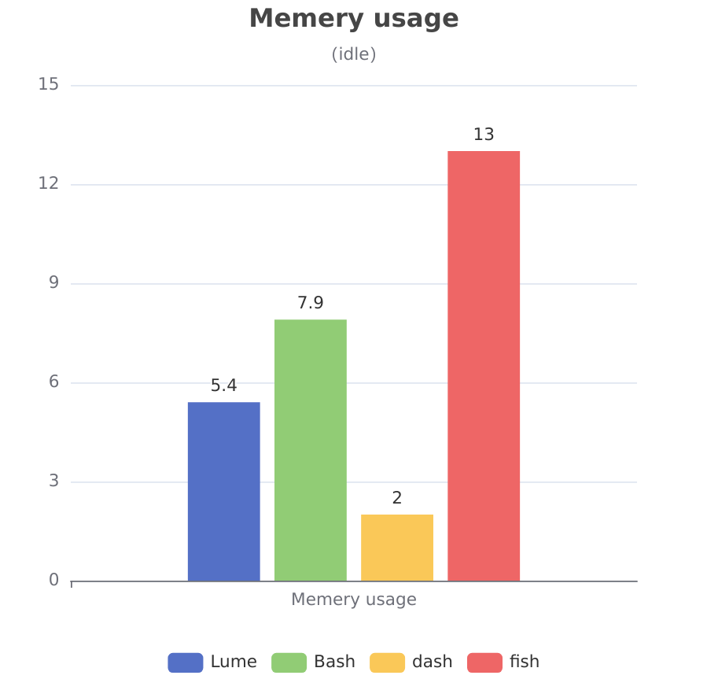

### [Readme English](README.md)

# Lumesh - 一个光速Shell

- 开发现在在 Codeberg [https://codeberg.org/santo/lumesh] 继续进行， GitHub [https://github.com/superiums/lumesh] 仓库将成为镜像。

- 从现在开始，GitHub上的问题和拉取请求将被忽略。


欢迎使用 Lumesh，一个强大的照明Shell，完全重写自  [Dune](https://github.com/adam-mcdaniel/dune)!

[lumesh](https://codeberg.org/santo/lumesh/raw/branch/main/assets/lumesh.png)

Lumesh旨在提供快速、高效和用户友好的命令行体验，通过多种新功能提升您的生产力。

 * 像 python/js 一样编写
 * 像 bash 一样工作
 * 像 光 一样运行
 * 像 空气 一样静谧
 * 像 水 一样流动

## 目录

- [Wiki](#wiki)
- [功能](#features)
- [安装](#安装)
- [开始](#开始)
- [基准测试](#基准测试)
- [贡献](#贡献)
- [许可证](#许可证)

## Wiki
有关详细文档和指南，请访问我们的 Wiki [https://codeberg.com/santo/lumesh/wiki/HOME-cn.md]。

wiki-English [https://codeberg.org/santo/lumesh/wiki/HOME]

## 功能
### 从Dune改进的功能
 * 快速和高效：针对速度和资源管理进行了优化。
 * 语法高亮：通过命令的语法高亮增强可读性。
### 新功能
 * 用户友好：以简洁为设计理念，提供更好的用户体验。
 * 扩展的语法支持：为命令提供更全面的语法选项。
 * 内置模块：多种内置模块以扩展功能。
 * 环境变量管理：轻松处理环境变量。
 * 登录Shell支持：无缝集成作为登录Shell。
 * 命令建议：在输入时智能建议命令。
 * 强大的错误处理：强大而快速的错误捕获和处理。
 * 本地AI支持：利用AI能力增强命令执行。

自版本0.3.0以来，脚本解析器、执行器和前端已完全重写，旨在提高效率和语法扩展的灵活性。

在我们的 ChangeLog [CHANGELOG.md] 中发现更多功能。

## 基准测试

|  |  |
|------------------------|------------------------|

由于fish无法完成一百万次的任务，我们记录了其一半任务的时间

*软件包大小（安装后）*
- lume v0.3.8: 4.3 MB
- bash v5.2.037: 9.2 MB
- dash v0.5.12: 153.8 KiB
- fish v4.0.2: 21.64 MB


## 安装

您可以通过两种方式安装Lumesh：
 1. 从最新版本下载：从我们的 发布页面 获取预编译的二进制文件。

- [发布页面1](https://codeberg.com/santo/lumesh/releases).
- [发布页面2](https://github.com/superiums/lumesh/releases)

 2. 从源代码编译：
   ```bash
   git clone 'https://codeberg.com/santo/lumesh.git'
   cd lumesh
   cargo build --release
   ```

## 开始

安装后，只需运行Lumesh可执行文件：
```bash
lume
```

## 贡献
我们欢迎贡献！如果您想为Lumesh做贡献，请查看我们的 贡献指南 [CONTRIBUTING.md]。

## 许可证
Lumesh根据MIT许可证发布。有关更多详细信息，请参阅 LICENSE [LICENSE] 文件。

----------------------------------------
感谢您选择Lumesh！我们希望您能像我们构建它时一样享受使用它。如果您有任何问题或反馈，请随时通过我们的GitHub仓库与我们联系。祝您编程愉快！
