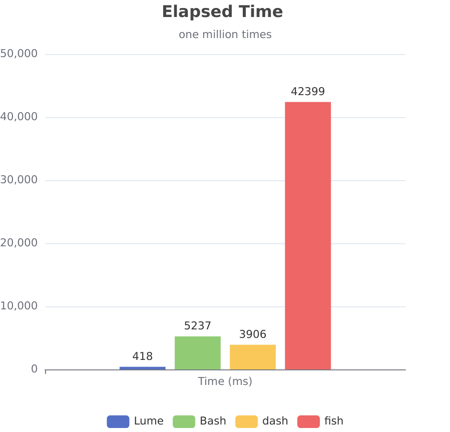

[English](README.md) | 简体中文

# Lumesh


[Codeberg](https://codeberg.org/santo/lumesh)
| [GitHub](https://github.com/superiums/lumesh)
[文档](https://lumesh.codeberg.page/)
| [DeepWiki](https://deepwiki.com/superiums/lumesh)
| [发布页 1](https://github.com/superiums/lumesh/releases)
| [发布页 2](https://codeberg.com/santo/lumesh/releases)
| [语法高亮](https://github.com/superiums/tree-sitter-lumesh)


```
     ⚡┓
      ┃ ┓┏┏┳┓┏┓
      ┗┛┗┻┛┗┗┗  lightweight ultimate modern efficient 
```  

**像 js 一样编写，像 Bash 一样工作，像光一样运行**

Lumesh 是一个现代化的 shell 和脚本语言, Bash替代者，完全重写自 Dune，专为高性能和用户友好体验而设计。

## Lume 的名称由来
**Lume** [lʌmi] 有光的含义，代表轻盈、快速。

- **L**ightweight

  Lume Shell 是一个轻量级的 shell，设计简洁、资源占用少，适合需要快速启动和高效运行的场景。

- **U**ltimate

  Lume Shell 是一个功能强大的工具，提供全面的命令行体验，满足高级用户的需求。

- **M**odern

  Lume Shell 采用现代的设计理念和技术，支持最新的脚本语言特性和交互方式。

- **E**fficient

  Lume Shell 在执行命令、处理脚本等方面效率高、响应快。


## ⚑ 为什么选择 Lumesh？

### 性能对比

| 对比项目|    lume       |     bash      |     dash      |     fish      |
|---------|---------------|---------------|---------------|---------------|
| 速度(百万循环)    |     *****     |     ***       |     ****      |    *          |
| 语法友好    |     *****     |     **        |     *         |    ****       |
| 错误提示|     *****     |     *         |     *         |    ***        |
| 错误处理|     *****     |     *         |     *         |    *          |
| 内置库  |     *****     |               |               |    *       |
| 交互    |     ****      |     **        |     *         |    *****      |
| 体积    |     ****      |     ***       |     *****     |    **         |
| 按键绑定|     ☑      |               |               |     ☑         |
| 结构化管道|     ☑      |               |               |              |
| AI交互  |     ☑        |               |               |               |

## ⚑ 核心特性

### ⚡ 跨平台
在任何地方拥有一致的体验。

### ⚡ 直观的语法设计

```bash
# 像现代编程语言一样的语法
let user = {name: "Alice", age: 25}
let {name, age} = user
let numbers = 1..10 | list.filter(x -> x > 5)
let [a, b] = [1, 2]

```


### ⚡ 链式调用
支持类似面向对象语言的链式方法调用：

```bash
"hello world".split(' ').join(',')
data | .filter(x -> x > 0)
```


### ⚡ 强大的错误处理
比传统 shell 更智能的错误提示、错误捕获和处理机制。

```bash
command ?.        # 忽略错误
command ?: e      # 错误捕获 或 默认值
command ?+        # 打印到标准输出
command ??        # 打印到错误输出
command ?>        # 覆盖打印 （数据通道）
command ?!        # 遇错终止  (终止管道)
```


### ⚡ 多样化管道操作
```bash
data | process           # 标准管道,支持结构化数据
data | positional a _ c  # 位置管道
data |> loop_deel        # 循环管道
data |^ interactive      # PTY 管道
```

结构化管道：
```bash
ls -l | .to_table() | where(size > 5K)
Fs.ls -l | where(size > 5K) | select(name,size,modified)
ls -1 |> cp -r _ /tmp/
```


### ⚡ 丰富的内置模块
- **集合操作**: `List.reduce, List.map`
- **文件系统**: `Fs.ls, Fs.read, Fs.write`
- **字符串处理**: `String.split, String.join`、正则模块
- **时间操作**: `Time.now, Time.format`
- **数据转换**: `Into`, `From`
- **数学计算**: 完整的数学函数库
- **日志记录**: `Log`模块
- **UI操作**: `Ui.pick, Ui.confirm`


### ⚡ 函数装饰器
支持函数装饰器语法：

```bash
@decorator_name
@decorator_with_args(arg)
fn my_function() { ... }
```


### ⚡ 模块导入
支持模块导入语法:

```bash
use moduleA as ma
ma::method()
```


### AI 集成支持
内置本地 AI 助手，支持命令补全和智能建议


## ⚑ 快速开始

### 安装方式

**方式一：使用安装脚本**
- [下载install.sh](https://github.com/superiums/lumesh/releases/latest)
  然后运行 `bash ./install.sh`
  
**方式二：下载预编译版本**
- [release-page 1](https://codeberg.com/santo/lumesh/releases)
- [release-page 2](https://github.com/superiums/lumesh/releases)

> 如需命令参数自动完成功能，需手动解压data到数据目录

**方式三：从源码编译**
```bash
git clone 'https://codeberg.com/santo/lumesh.git'
cd lumesh
cargo build --release

**方式四：从cargo编译**
```bash
cargo install lumesh
```
```

### 立即体验
- **`lume`**: 完整shell，支持 REPL、自动补全、语法高亮
- **`lume-se`**: 轻量级脚本执行器，快速启动，最小依赖

```bash
# 启动交互式 shell
lume

# 或执行脚本
lumesh script.lm
```

### 语法高亮
- 命令行语法高亮：开箱支持
- 编辑器语法高亮：
 [tree-sitter](https://github.com/superiums/tree-sitter-lumesh)
 
## 基准测试

|  |  |
|------------------------|------------------------|

_由于fish无法完成一百万次的任务，我们记录了其一半任务的时间_

**从v0.10.1开始，lumesh在循环遍历中性能提升近两倍**

**从v0.11.0开始，lumesh内存占用下降约0.8MB**

## ⚑ 版本历程
最近的开发重点：

- 对函数增强的装饰器支持
- 兼容性的IFS（内部字段分隔符）模式控制
- 增强的模块系统，模块之间的交叉链接
- 改进的错误报告和调试能力
- CFM (命令优先模式) 方便日常命令行使用场景 (v0.8.0)
- 更友好的帮助信息 (v0.8.5)
- 来自fish的命令参数自动完成 (v0.8.8)
- 自动完成检测逻辑优化 (v0.8.8)
- 模块化编程支持 (v0.10.0)
- 内置库动态懒加载支持 (v0.10.1)
- 更灵活的占位符支持 (v0.10.2)
- 更好用的CFM (v0.11.1)
- 中间件式的装饰器支持 (v0.11.5)
- 循环迭代器优化 (v0.11.5)
- 局部变量支持 (v0.11.6)

---


**立即开始您的 Lumesh 之旅吧！**
