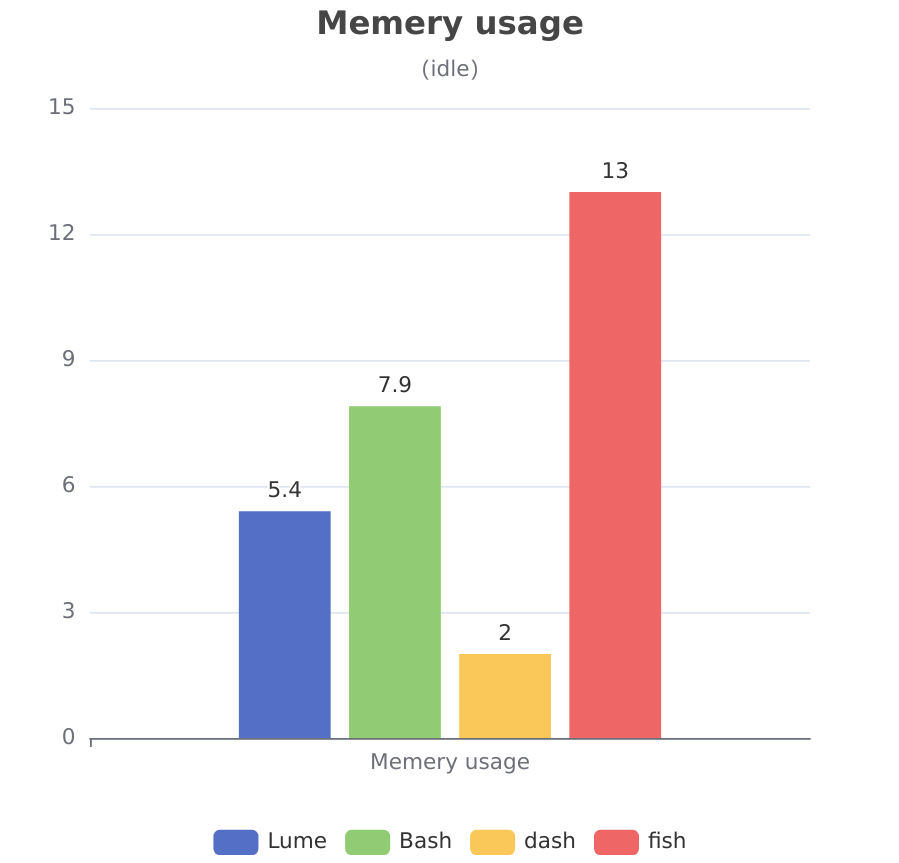
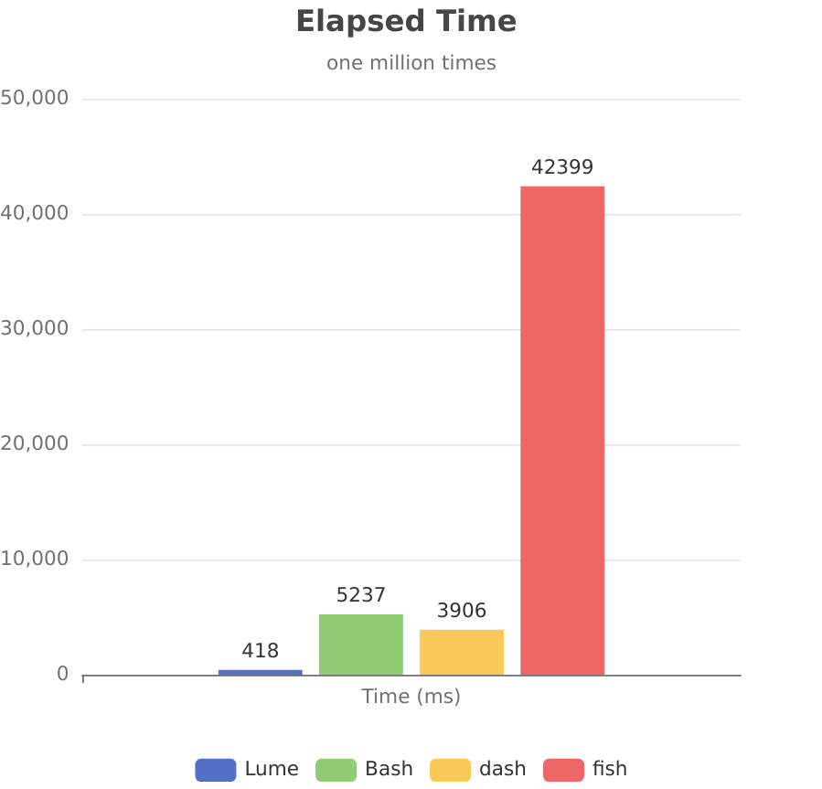

### [中文说明-点这里](README-cn.md)
# Lumesh - a lighting Shell

### Development is now continuing on [Codeberg](https://codeberg.org/santo/lumesh), with the [GitHub](https://github.com/superiums/lumesh) repository becoming a mirror. Issues & pull requests on GitHub will be ignored from now on.


Welcome to **Lumesh**, a powerful lighting shell, full rewrite of [Dune](https://github.com/adam-mcdaniel/dune)!

[lumesh](https://codeberg.org/santo/lumesh/raw/branch/main/assets/lumesh.png)

Lumesh aims to provide a fast, efficient, and user-friendly command-line experience, enhancing your productivity with a variety of new features.

- write like `python`/`js`
- works like `bash`
- runs like **light**
- stays like **air**
- flows like **water**

## Why lumesh

| compare |    lume       |     bash      |     dash      |     fish      |
|---------|---------------|---------------|---------------|---------------|
| speed(million circle)    |     *****     |     ***       |     ****      |    *          |
| interactive    |     ****      |     **        |     *         |    *****      |
| sytax    |     *****     |     **        |     *         |    ****       |
| size    |     ****      |     ***       |     *****     |    **         |
| error tips|     *****     |     *         |     *         |    ***        |
| builtin Lib  |     *****     |               |               |    ****       |
| AI helper  |     ☑        |               |               |               |


## Table of Contents
- [Wiki](#wiki)
- [Features](#features)
- [Installation](#installation)
- [Getting Started](#getting-started)
- [Benchmark](#benchmark)
- [Contributing](#contributing)
- [License](#license)

## Wiki
For detailed documentation and guides, visit our [Wiki](https://codeberg.com/santo/lumesh/wiki).

[中文wiki](https://codeberg.org/santo/lumesh/wiki/HOME-cn.md)

## Features

### Improved Features from Dune
- **Fast and Efficient**: Optimized for speed and resource management.
- **Syntax Highlighting**: Enhanced readability with syntax highlighting for commands.

### New Features
- **User-Friendly**: Designed with simplicity in mind for a better user experience.
- **Extended Syntax Support**: More comprehensive syntax options for commands.
- **Built-in Modules**: A variety of built-in modules to extend functionality.
- **Environment Variable Management**: Easy handling of environment variables.
- **Login Shell Support**: Seamless integration as a login shell.
- **Command Suggestions**: Intelligent suggestions for commands as you type.
- **Powerful Error Handling**: Powerful and swift error catch and deeling.
- **Local AI Support**: Leverage AI capabilities for enhanced command execution.

The script parser, executor, and front end have been completely rewritten since version 0.3.0, targeting improved efficiency and flexibility for syntax extension.

Discover more features in our [ChangeLog](CHANGELOG.md).

## Benchmark

|  |  |
|------------------------|------------------------|

_as fish was unable to fishish one million times task, we take the time of its harf task_


## Installation

You can install Lumesh in two ways:

1. **Download from the Latest Release**: Get the precompiled binaries from our
- [releases page 1](https://codeberg.com/santo/lumesh/releases).
- [release-page 2](https://github.com/superiums/lumesh/releases)
2. **Compile from Source**:
   ```bash
   git clone 'https://codeberg.com/santo/lumesh.git'
   cd lumesh
   cargo build --release
   ```

## Getting Started

After installation, simply run the Lumesh executable:

```bash
# Start Lumesh
lume
```

## Contributing

We welcome contributions! If you would like to contribute to Lumesh, please check out our [Contributing Guidelines](CONTRIBUTING.md).

## License

Lumesh is licensed under the MIT License. See the [LICENSE](LICENSE) file for more details.

---

Thank you for choosing Lumesh! We hope you enjoy using it as much as we enjoyed building it. If you have any questions or feedback, feel free to reach out through our GitHub repository. Happy scripting!
