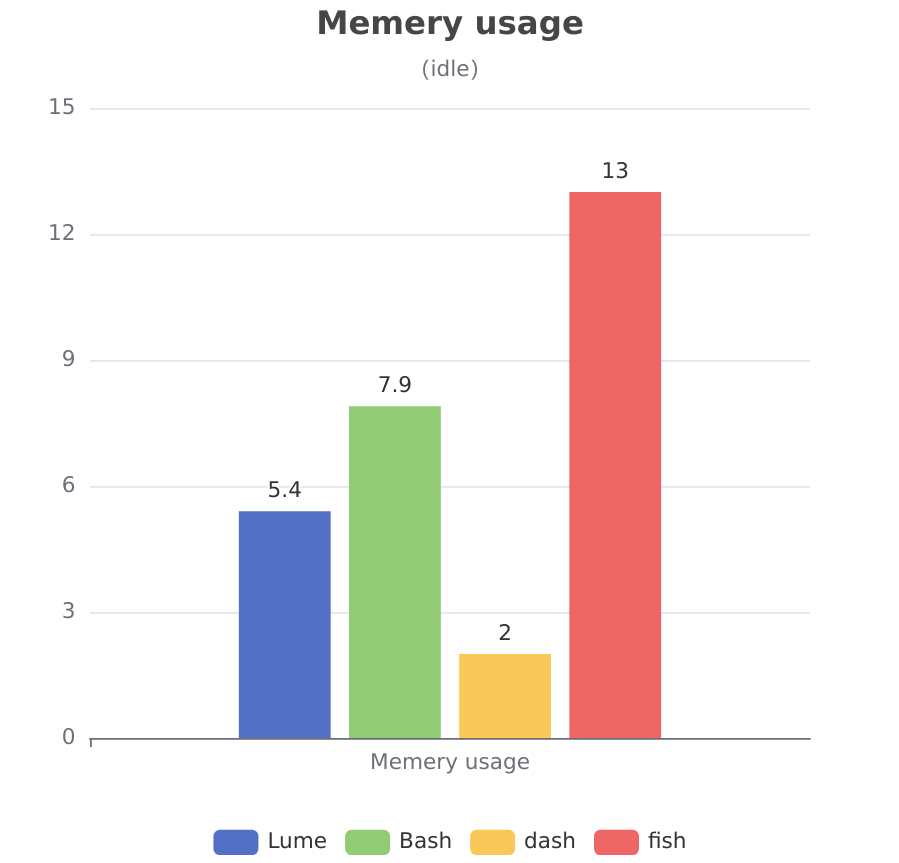
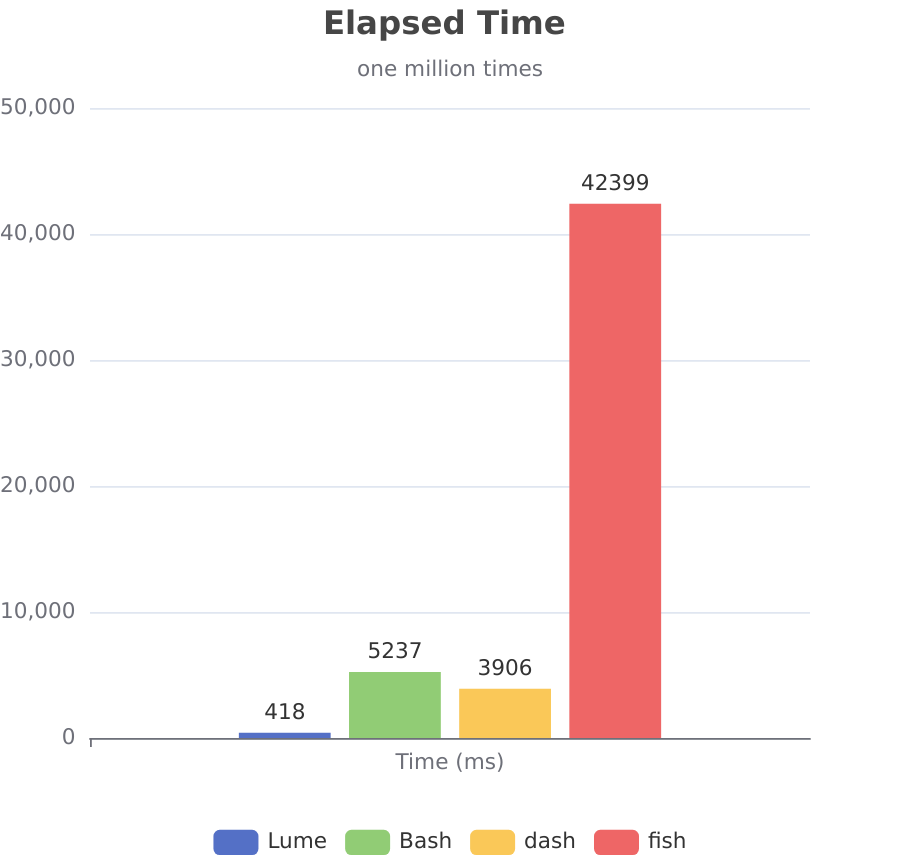

English | [简体中文)(README-cn.md)

# Lumesh — Your Next Default Shell

[]()
[]()
[]()

[Codeberg](https://codeberg.org/santo/lumesh)
| [GitHub](https://github.com/superiums/lumesh)
| [Documentation](https://www.lumesh.cc.cd)
| [DeepWiki](https://deepwiki.com/superiums/lumesh)
| [Release Page 1](https://github.com/superiums/lumesh/releases)
| [Release Page 2](https://codeberg.org/santo/lumesh/releases)
| [Syntax Highlighting Plugin](https://github.com/superiums/tree-sitter-lumesh)

```
     ⚡┓
      ┃ ┓┏┏┳┓┏┓
      ┗┛┗┻┛┗┗┗  Lightweight · Ultimate · Modern · Efficient
```

> **Write scripts like JavaScript, call commands like Bash, run like light.**

---

## Are You Still Enduring These Bash Pains?

```bash
# Bash: String comparison requires quotes, otherwise errors
if [ "$var" = "hello" ]; then ...

# Bash: Arrays? Associative arrays? Syntax is like solving a puzzle
declare -A map
map["key"]="value"
for k in "${!map[@]}"; do echo "$k: ${map[$k]}"; done

# Bash: Error handling relies almost entirely on set -e, one error crashes the whole script
set -e
some_command || echo "failed"

# Bash: Want to process a JSON list? Install jq first, write a bunch of pipelines, then pray it doesn't error
result=$(cat data.json | jq -r '.[] | select(.age > 18) | .name' 2>/dev/null) || echo "failed"  
  
```
**Bash was born in 1989. It was never designed for modern developers.**

You fight its historical baggage every day:
- String and array syntax traps are maddening
- Error handling is either all-exit or all-ignore, no middle ground
- Structured data processing completely depends on external tools
- Long scripts become unmaintainable "shell spaghetti"

**It's time to switch to a shell designed for modern people.**

## Meet Lumesh — Your Next Shell


Lumesh is a modern shell and scripting language written in Rust, fully compatible with external commands while bringing JavaScript-like programming capabilities.

No need to abandon your existing knowledge. ls, git, grep, curl — all commands run as usual. You just get everything better.

---
## Compare and Feel the Difference

### Error Handling: From Nightmare to Elegant

```bash
# Bash way: fragile, verbose
if ! command_that_might_fail 2>/dev/null; then
    echo "failed" >&2
    exit 1
fi
```

```bash
# Lumesh way: 7 precise error operators
command ?.          # Ignore error, continue execution
command ?: handler  # Use default value/handler function on error
command ?!          # Terminate entire pipeline on error
command ?~          # Convert error to boolean false
```

### Data Processing: Goodbye to awk/sed/jq Combo

```bash
# Filter large files, keep only entries above 5K, show only name and size
fs.ls -lh | where(size > 5K) | select(name, size, modified)

# Map/filter on lists, like writing JavaScript
1...100 | list.filter(x -> x % 2 == 0) | list.map(x -> x * 2)

# Batch operations: copy all files in current directory to /tmp/
ls -1 |> cp -r _ /tmp/
```

### Variables and Data Structures: Finally Like a Normal Language

```bash
# Destructuring assignment
let user = {name: "Lume", age: 3}
let {name, age} = user

# Ranges and chained calls
"hello world".split(' ').join('-')   # => "hello-world"

# Rich types: List, Map, Set, Range, all natively supported
let scores = [95, 87, 72, 88]
let avg = scores | list.foldl((a, b) -> a + b) | _ / scores.len()
```

### Modular Scripting: Writing Large Projects Is No Longer a Disaster

```bash
use my_utils as utils
utils::send_report(data)

@retry(3)           # Decorator: auto-retry 3 times on failure
@log_time           # Decorator: auto-record execution time
fn deploy() { ... }
```

---

## Performance: Not Just Better to Use, But Faster

| Comparison Item   | lume  | bash | dash  | fish  |
| ------------------ | ----- | ---- | ----- | ----- |
| Speed (million loops) | ★★★★★ | ★★★  | ★★★★  | Cannot complete  |
| Syntax Friendliness | ★★★★★ | ★★   | ★     | ★★★★  |
| Error Message Quality | ★★★★★ | ★    | ★     | ★★★   |
| Error Handling Capability | ★★★★★ | ★    | ★     | ★     |
| Built-in Function Library | ★★★★★ | —    | —     | ★     |
| Interactive Experience | ★★★★★ | ★★   | ★     | ★★★★★ |
| Binary Size | ★★★★  | ★★★  | ★★★★★ | ★★    |
| Structured Pipeline |  √    | —    | —     | —     |
| AI Assistance | ✅√   | —    | —     | —     |

|  |  |
| --------------------------------- | ---------------------------------- |

> From v0.10.1, loop performance improved by about 2x; from v0.11.0, memory usage decreased by about 0.8 MB.

---

## Bash vs Lumesh Syntax Quick Reference

| Scenario       | Bash                                  | Lumesh                         |
| -------------- | ------------------------------------- | ------------------------------ |
| Variable Assignment | `name="Alice"`                        | `let name = "Alice"`           |
| String Interpolation | `echo "Hello $name"`                  | `` echo `Hello {name}` ``      |
| Conditional Judgment | `if [ "$a" -gt 1 ]; then;do ... done` | `if a > 1 { ... }`             |
| Loop           | `for i in $(seq 1 10); do ... done`   | `for i in 1..10 { ... }`       |
| Function Definition | `myfunc() { ... }`                    | `fn myfunc() { ... }`          |
| Array          | `arr=(1 2 3)`                         | `let arr = [1, 2, 3]`          |
| Dictionary/Map | Requires `declare -A`                   | `let m = {a: 1, b: 2}`         |
| Destructuring Assignment | Not supported                        | `let {name, age} = user`       |
| Error Ignoring | `command 2>/dev/null \|\| true`       | `command ?.`                   |
| Pipeline Structured Data | Not supported (requires jq/awk)                   | Native support                       |
| Chained Calls   | Not supported                        | `"hello".split(' ').join(',')` |
| Module Import   | Not supported                        | `use mylib as lib`             |

---

## Migration Guide: Replace Bash in Three Steps

### Step 1: Install Lumesh

**Method 1: Use Installation Script (Recommended)**

```bash
# Download and run installation script
curl -LO https://github.com/superiums/lumesh/releases/latest/download/install.sh
bash ./install.sh
```

**Method 2: Download Precompiled Binary**

- [GitHub Release Page](https://github.com/superiums/lumesh/releases)
- [Codeberg Release Page](https://codeberg.org/santo/lumesh/releases)

> For command parameter auto-completion, extract `data.tgz` from the release package to the data directory.

**Method 3: Compile from Source**
**Method 4: Install via Cargo**

---

### Step 2: Experience Interactive Shell

After installation, run `lume` directly to enter interactive mode:

```bash
lume
```

You'll immediately get:

- **Syntax Highlighting**: Real-time highlighting of commands, variables, and strings during input, errors visible at a glance
- **Smart Completion**: Automatic completion for paths, commands, parameters (including fish-style parameter hints), even AI-assisted completion (`ALT+i`)
- **Modern Hotkeys**: `Ctrl+/` command menu, `Alt+g` quick directory jump, `CTRL_SHIFT_f` quick file selection...
- **AI Assistance**: Let AI help you write code (`ALT+Enter`)

You can try:

- `help` command to understand built-in commands
- `help doc` to view online documentation
- Execute regular third-party commands
- Use built-in libraries to write functions and scripts

---

### Step 3: Set Lumesh as Default Shell

Execute in lume:

```bash
use lman
lman::chsh()
```

After re-login, your terminal default will be Lumesh.

---

## Migrate Existing Bash Scripts

Lumesh uses `.lm` as the script extension. When migrating Bash scripts, main changes focus on:

**1. Shebang Line**

```bash
#!/usr/bin/env lumesh
```

> `lumesh` can optionally link to `lume` or `lume-se`
> `lume-se` is a non-interactive lightweight script executor, suitable for CI/CD and automation scenarios.

**2. Add `let` to Variable Declarations**

```bash
# Bash
NAME="world"

# Lumesh
let NAME = "world"
```

**3. Conditional and Loop Syntax**

```bash
# Bash
for f in *.txt; do
  echo "$f"
done

# Lumesh
for f in *.txt {
  print f
}
```

**4. Command Calls Need No Changes**

Lumesh's CFM (Command First Mode) lets you call external commands directly like in Bash:

```bash
git status
docker ps -a
ping 1.1.1.1
chmod +x ./script.lm
```

---

### ⚡ Rich Built-in Modules (No Need to Install Third-Party Tools)

| Module            | Functionality                               |
| --------------- | ---------------------------------- |
| `list`          | map, filter, reduce, sort, unique… |
| `string`        | split, join, trim, replace, pad…   |
| `fs`            | ls, read, write, copy, move…       |
| `map`           | Mapping operations                           |
| `table`         | Table operations                           |
| `regex`         | Regex matching, replacement, extraction               |
| `time`          | Time formatting, calculation, timezone             |
| `math`          | Complete math function library                     |
| `into` / `from` | Data type conversion                       |
| `ui`            | Interactive selection, confirmation dialogs             |
| `log`           | Structured log output                     |
| ...             | Use `help libs` to see more            |

**Constant Modules**

- `COLOR`
- `MATH`
- `STYLE`


---


## Multiple Binaries, Choose as Needed

| Binary          | Size    | Use Case                                                     |
| --------------- | ------- | ------------------------------------------------------------ |
| `lume`          | ~3.9 MB | Daily interactive Shell, includes REPL, completion, highlighting + local HTTP protocol AI assistance |
| `lume-se`       | ~2.7 MB | Script execution, CI/CD, embedded, fast startup                            |
| `lume-ai-https` | ~5.4 MB | Interactive Shell + online HTTPS protocol AI assistance                            |

---

## Syntax Highlighting Support

- **In Terminal**: Out-of-the-box, real-time highlighting
- **In Editors**: Via [tree-sitter-lumesh](https://github.com/superiums/tree-sitter-lumesh) supporting Neovim, Helix and other editors

---

## Most Flexible Hotkey Support

- Users can bind custom hotkeys to custom functions
- This function can read and modify the currently entered command line
- This means you can unleash your creativity to accomplish any functionality you want

**For example**
- Auto-correct input errors
- Save/call history directory/bookmark commands
- Call `ui` module to create menus/dialogs for quick navigation
- Call `xdg-open` to quickly open files
- Create specific command menus for specific workspaces
- ...

---

## Version Highlights

- v0.8.0: CFM Command First Mode, daily commands need no quotes
- v0.10.0: Modular programming support
- v0.11.5: Middleware-style decorators, loop iterator optimization
- v0.11.6: Closure free variable capture, local variable support
- v0.12.7: HashMap/BTreeSet data types, constant support (COLOR/STYLE/MATH)
- v0.15.0: Rewritten editor for smoother experience
- v0.15.4: Richer auto-completion features
- v0.15.5: Rewritten lexer for higher parsing efficiency

---


**Start your Lumesh journey now and say goodbye to Bash's historical baggage.**
